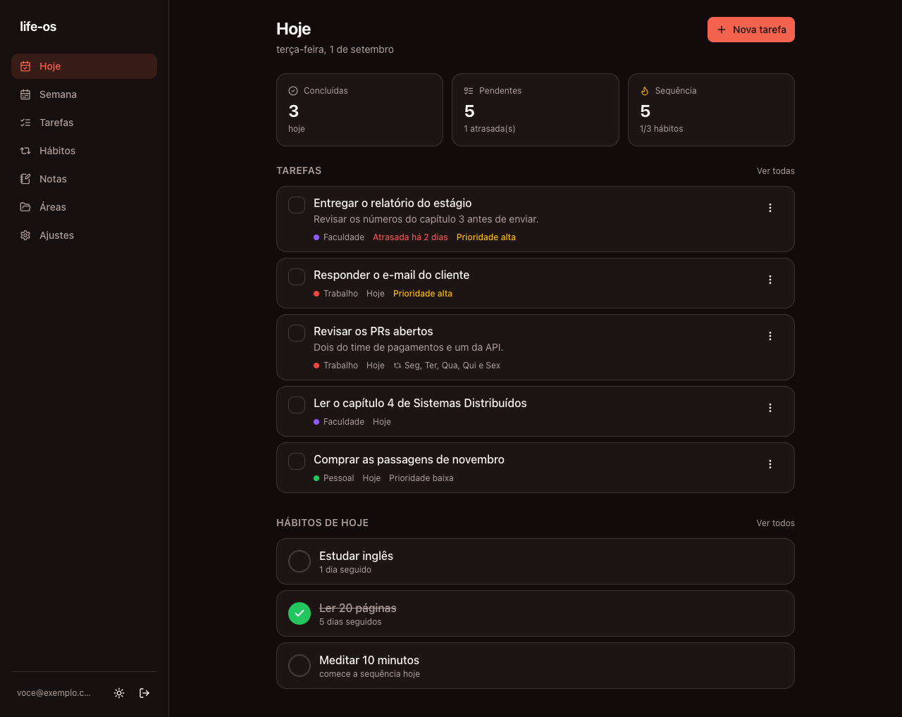
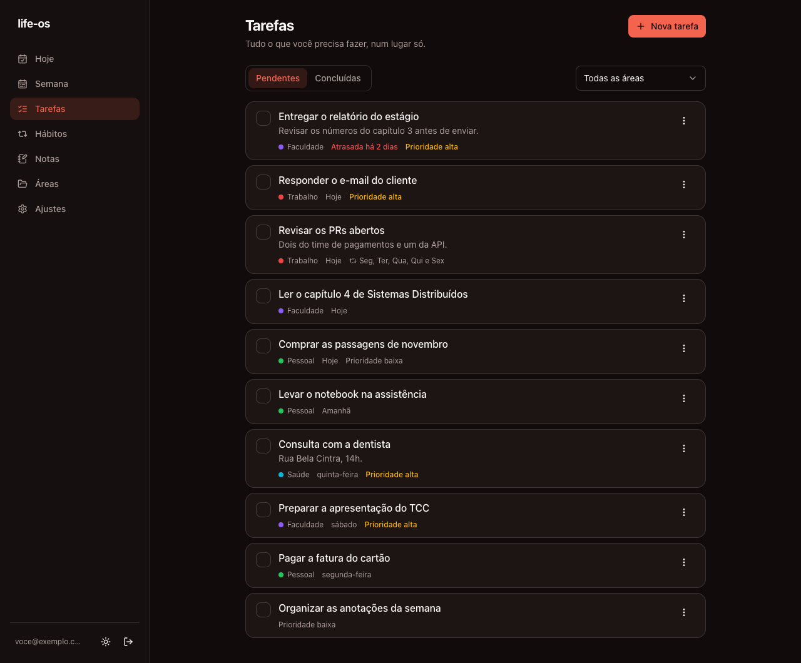
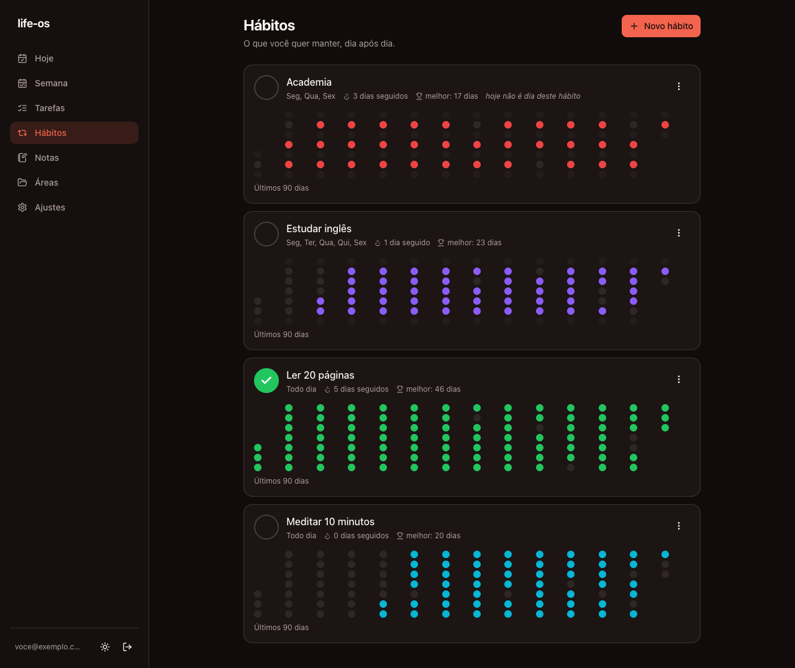

# life-os

Sistema pessoal de organização: **tarefas, hábitos e a visão do seu dia**.

Feito para uso diário e para rodar bem no celular. Interface em português,
tema escuro por padrão, dados isolados por usuário no Postgres com Row Level
Security.

---

## Screenshots

> As imagens ainda não foram capturadas — veja
> [`docs/screenshots/`](docs/screenshots/) para os arquivos esperados.

| Hoje | Tarefas | Hábitos |
| ---- | ------- | ------- |
|  |  |  |

---

## O que tem na v1

- **Autenticação** por e-mail e senha (Supabase Auth), com rotas protegidas
  por middleware.
- **Áreas** — agrupadores das tarefas (Trabalho, Faculdade, Pessoal…), com
  nome e cor.
- **Tarefas** — título, descrição, área, prioridade, vencimento e status.
  - **Recorrência** diária, semanal (dias da semana) ou mensal (dia fixo).
    Ao concluir a ocorrência de hoje, a próxima é calculada e criada.
- **Hábitos** — frequência alvo por dias da semana, check-in diário,
  sequência atual, melhor sequência e grade de consistência dos últimos 90
  dias (estilo *contribution graph* do GitHub).
- **Visão "Hoje"** — o que vence hoje ou está atrasado, os hábitos do dia com
  check-in rápido e os contadores do dia.

Datas usam o fuso **America/Sao_Paulo**: "hoje" é sempre o dia civil em São
Paulo, independente de onde o servidor estiver rodando.

---

## Stack

| Camada        | Escolha                                             |
| ------------- | --------------------------------------------------- |
| Framework     | Next.js 15 (App Router) + React 19                   |
| Linguagem     | TypeScript em modo estrito                           |
| Banco / Auth  | Supabase (Postgres + Auth + Row Level Security)      |
| Interface     | Tailwind CSS v4 + shadcn/ui + lucide-react           |
| Validação     | Zod (mesmos esquemas no formulário e na Server Action) |
| Datas         | date-fns + date-fns-tz                               |
| Qualidade     | ESLint + Prettier                                    |

Server Components por padrão; Client Components apenas onde há
interatividade. Toda mutação passa por uma **Server Action** com validação Zod
e retorno de erro explícito.

---

## Rodando localmente

### Pré-requisitos

- Node.js 20 ou superior
- Uma conta no [Supabase](https://supabase.com) (o plano gratuito basta)
- [Supabase CLI](https://supabase.com/docs/guides/local-development/cli/getting-started)
  para aplicar as migrations

### 1. Clone e instale

```bash
git clone https://github.com/<seu-usuario>/life-os.git
cd life-os
npm install
```

### 2. Configure as variáveis de ambiente

```bash
cp .env.example .env.local
```

Preencha com os dados do seu projeto Supabase (**Project Settings → Data
API**):

```
NEXT_PUBLIC_SUPABASE_URL=https://seu-projeto.supabase.co
NEXT_PUBLIC_SUPABASE_ANON_KEY=sua-chave-anon
```

> A chave `anon` é pública por design — o acesso aos dados é controlado por
> RLS no banco. A `service_role` **não** é usada neste projeto e nunca deve
> ser colocada em `.env.local` nem versionada.

### 3. Aplique as migrations

O esquema vive em [`supabase/migrations/`](supabase/migrations/) e é aplicado
pela CLI — nada é criado à mão pelo dashboard:

```bash
supabase login
supabase link --project-ref <ref-do-seu-projeto>
supabase db push
```

Isso cria as cinco tabelas, os índices e as policies de RLS.

### 4. Ajuste a autenticação no Supabase

Em **Authentication → Providers → Email**:

- mantenha **Email** habilitado (login por e-mail e senha);
- se quiser entrar sem confirmar o e-mail durante o desenvolvimento,
  desative **Confirm email**.

Em **Authentication → URL Configuration**, adicione
`http://localhost:3000/auth/confirmar` às *Redirect URLs* — é para onde o link
de confirmação aponta.

### 5. Rode

```bash
npm run dev
```

Abra <http://localhost:3000>, crie sua conta e comece pelas **Áreas**.

---

## Scripts

| Comando                | O que faz                                  |
| ---------------------- | ------------------------------------------ |
| `npm run dev`          | Servidor de desenvolvimento                 |
| `npm run build`        | Build de produção                           |
| `npm start`            | Sobe o build de produção                    |
| `npm run lint`         | ESLint                                      |
| `npm run typecheck`    | TypeScript sem emitir arquivos              |
| `npm run format`       | Prettier em modo escrita                    |
| `npm run format:check` | Prettier em modo verificação                |

---

## Estrutura de pastas

```
life-os/
├── docs/
│   ├── RECORRENCIA.md        # a modelagem da recorrência, em detalhe
│   └── screenshots/
├── supabase/
│   ├── config.toml
│   └── migrations/           # esquema e RLS, versionados
├── src/
│   ├── app/
│   │   ├── (auth)/           # login e cadastro
│   │   ├── (app)/            # área autenticada: hoje, tarefas, hábitos, áreas
│   │   ├── auth/confirmar/   # troca o token do e-mail por sessão
│   │   ├── layout.tsx
│   │   └── globals.css
│   ├── components/
│   │   ├── ui/               # primitivos shadcn/ui
│   │   └── layout/           # navegação, tema
│   ├── features/             # uma pasta por domínio
│   │   ├── auth/
│   │   ├── areas/
│   │   ├── tasks/            # inclui recurrence.ts (funções puras)
│   │   ├── habits/           # inclui streaks.ts (funções puras)
│   │   └── today/
│   ├── lib/
│   │   ├── supabase/         # clientes: navegador, servidor e middleware
│   │   ├── date.ts           # fuso America/Sao_Paulo e datas flutuantes
│   │   ├── errors.ts         # ResultadoAcao: nenhum erro é engolido
│   │   └── validation.ts
│   ├── types/database.ts
│   └── middleware.ts         # renova a sessão e protege as rotas
```

Cada feature guarda o que é seu: `schemas.ts` (Zod), `queries.ts` (leitura em
Server Components), `actions.ts` (Server Actions) e `components/`.

---

## Decisões de arquitetura

- **Recorrência com materialização preguiçosa.** A tarefa guarda a *regra*;
  `task_occurrences` guarda o *estado datado*. Existe no máximo uma ocorrência
  em aberto por tarefa, e a próxima só nasce quando a atual é concluída — sem
  cron, sem job de background. O raciocínio completo, as alternativas
  descartadas e como evoluir estão em
  **[`docs/RECORRENCIA.md`](docs/RECORRENCIA.md)**.
- **Datas flutuantes.** Colunas `date` e strings `yyyy-MM-dd`, nunca
  convertidas para UTC. Só o "que dia é hoje" consulta o fuso.
- **O banco não confia na aplicação.** Constraints garantem que status e
  `completed_at` não divergem, que cada tipo de recorrência tem exatamente os
  seus campos e que a mesma tarefa não gera duas ocorrências na mesma data.
- **Erros nunca são engolidos.** Toda Server Action devolve
  `{ ok: true }` ou `{ ok: false, erro }` com mensagem em português, e o erro
  técnico vai para o log do servidor.
- **RLS em todas as tabelas.** Nenhuma consulta filtra por `user_id` na mão
  confiando só na aplicação — o Postgres recusa o que não é do usuário.

---

## Licença

[MIT](LICENSE).
